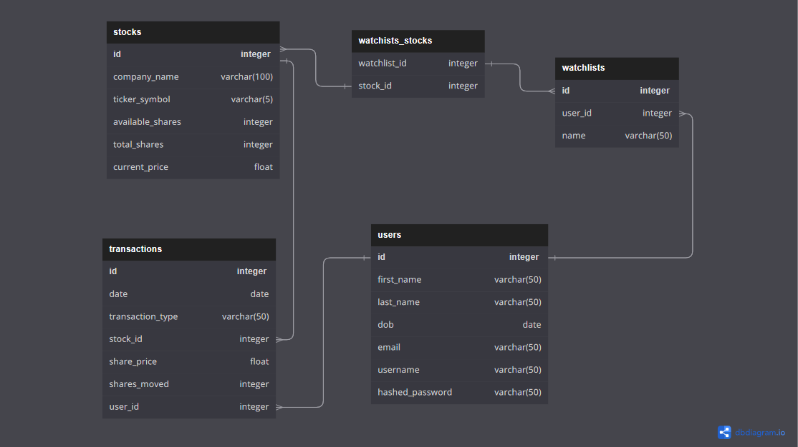

# WeBear (Webull Clone)

This Project is a clone for Webull stock platform. The two full CRUD features are portfolio and watchlist. Additional features include search, sort, and transactions. 
Implemented Chart JS for the visual chart data.

Link to live site [Webear](https://webull.onrender.com)

Check out the Wiki for more info [Wiki](https://github.com/Simpsonc86/Webull-Clone/wiki)

# Project Features
## Portfolio CRUD

The project includes a feature for the user to have a list of stock investments displayed in a user dashboard once the account is created. From there, a user can see a chart in the dash board that simulates their total market value over a set interval that they can choose from 1 day 90 days. The total portfolio of owned stocks are displayed in a section on the dashboard. Each row in the dashboard portfolio is a summary of the user's stock investment in a single company with relevant data pertaining to each company. Each stock you buy or sell in the Transactions section of the dashboard will update in the portfolio. Once you sell all of your available stocks of a certain company, the company row is removed from the portfolio.

## Watchlist CRUD

The project also includes watchlist functionality. A set of watchlist can be accessed by default. A user can create their own watchlist and add and remove stocks based on company name and symbol. 

## Transactions Feature
Transactions are how you purchase or sell stocks in the portfolio. From the dashboard, a user can set the amount of shares they wish to buy of an available stock, and then see the total cost of the investment before submitting the transactions. Each transaction will update in the portfolio. 

## Search Feature
The search allows you to type in a stock by company name and have the results filtered by what characters are input into the field. If the input value matches the a part of the string of letters in the company name, the resulting list of companies are shown. Clicking on a company in the list navigates to the individual company's page details.

## Sort Feature
The list of all stocks can be sorted by 7 different methods. Sort by Stock ID, Ascending Company Name, Descending Company Name, Price Low, Price High, Amount Available Least, and Amount Available Most.

## Technologies used
Python 3.9,
Flask,
SQLAlchemy,
React JS 17,
Redux,
Victory JS,
Validator JS

# Project Goals

The primary goals of this project are as follows:

   * To create a user-friendly and intuitive interface for managing imaginary stock investments.
   * To implement a portfolio system that allows users to easily view their investments.
   * To ensure data security and privacy by employing best practices in authentication and authorization.
   * To deliver a functional and reliable Webull clone that provides value to its users.
   * Collaborate on a new language and have daily SCRUM meetings.

Feel free to explore the project further and provide feedback on any additional features or improvements you'd like to see.

Happy trading!

# Getting Started

1. Clone the repository and from main branch on GitHub.

2. Install dependencies.

      ```bash
      pipenv install -r requirements.txt
      ```

3. Create a **.env** file based on the example with proper settings for your
   development environment.

4. Make sure the SQLite3 database connection URL is in the **.env** file.

5. Get into your pipenv, migrate your database, seed your database, and run your Flask app

   ```bash
   pipenv shell
   ```

   ```bash
   flask db upgrade
   ```

   ```bash
   flask seed all
   ```

   ```bash
   flask run
   ```

7. To run the React App in development, checkout the [README](./react-app/README.md) inside the `react-app` directory.


# DB Schema




